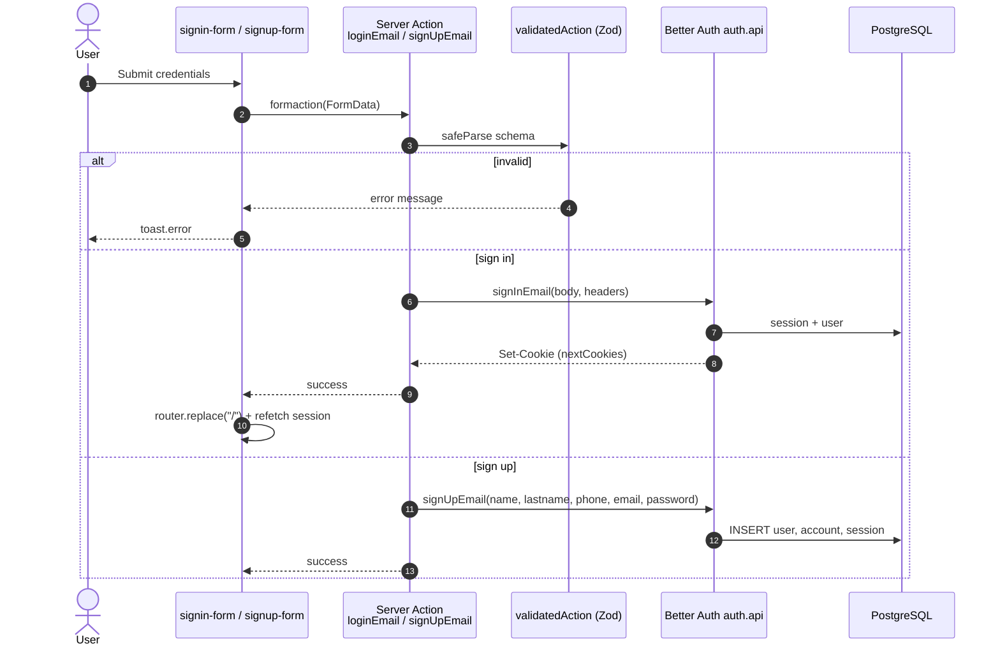

# Email authentication (Mermaid)

> Stack: Next.js Server Actions + Better Auth + PostgreSQL. Not Express/Passport.

```mermaid
sequenceDiagram
    autonumber
    actor U as User
    participant F as signin-form / signup-form
    participant A as Server Action<br/>loginEmail / signUpEmail
    participant Z as validatedAction (Zod)
    participant BA as Better Auth auth.api
    participant DB as PostgreSQL

    U->>F: Submit credentials
    F->>A: formaction(FormData)
    A->>Z: safeParse schema
    alt invalid
        Z-->>F: error message
        F-->>U: toast.error
    else sign in
        A->>BA: signInEmail(body, headers)
        BA->>DB: session + user
        BA-->>A: Set-Cookie (nextCookies)
        A-->>F: success
        F->>F: router.replace("/") + refetch session
    else sign up
        A->>BA: signUpEmail(name, lastname, phone, email, password)
        BA->>DB: INSERT user, account, session
        A-->>F: success
    end
```
