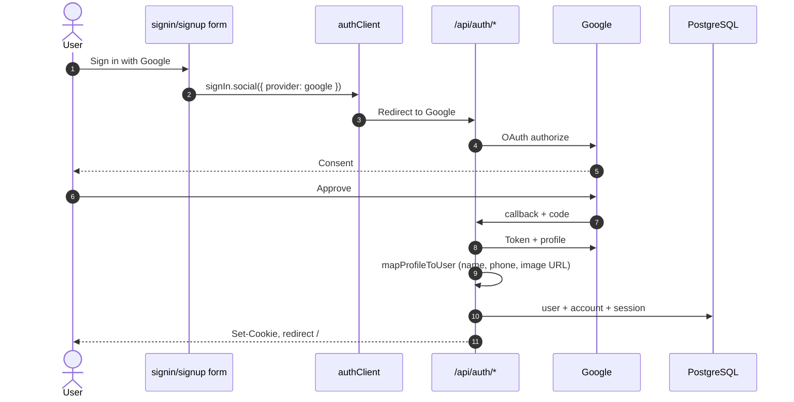

# Google OAuth (Mermaid)

```mermaid
sequenceDiagram
    autonumber
    actor U as User
    participant F as signin/signup form
    participant C as authClient
    participant API as /api/auth/*
    participant G as Google
    participant DB as PostgreSQL

    U->>F: Sign in with Google
    F->>C: signIn.social({ provider: google })
    C->>API: Redirect to Google
    API->>G: OAuth authorize
    G-->>U: Consent
    U->>G: Approve
    G->>API: callback + code
    API->>G: Token + profile
    API->>API: mapProfileToUser (name, phone, image URL)
    API->>DB: user + account + session
    API-->>U: Set-Cookie, redirect /
```
