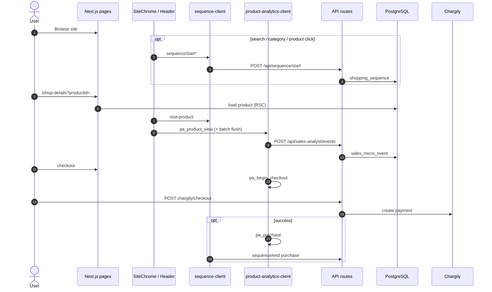

# Main storefront lifecycle (Mermaid)

```mermaid
sequenceDiagram
    autonumber
    actor U as User
    participant N as Next.js pages
    participant C as SiteChrome / Header
    participant S as sequence-client
    participant P as product-analytics-client
    participant API as API routes
    participant DB as PostgreSQL
    participant CH as Chargily

    U->>N: Browse site
    opt search / category / product click
        C->>S: sequenceStart*
        S->>API: POST /api/sequence/start
        API->>DB: shopping_sequence
    end
    U->>N: /shop-details?productId=
    N->>DB: load product (RSC)
    C->>S: visit-product
  C->>P: pa_product_view (+ batch flush)
    P->>API: POST /api/sales-analyst/events
    API->>DB: sales_micro_event
    U->>N: checkout
    P->>P: pa_begin_checkout
    U->>API: POST chargily/checkout
    API->>CH: create payment
    opt success
        P->>P: pa_purchase
        S->>API: sequence/end purchase
    end
```
