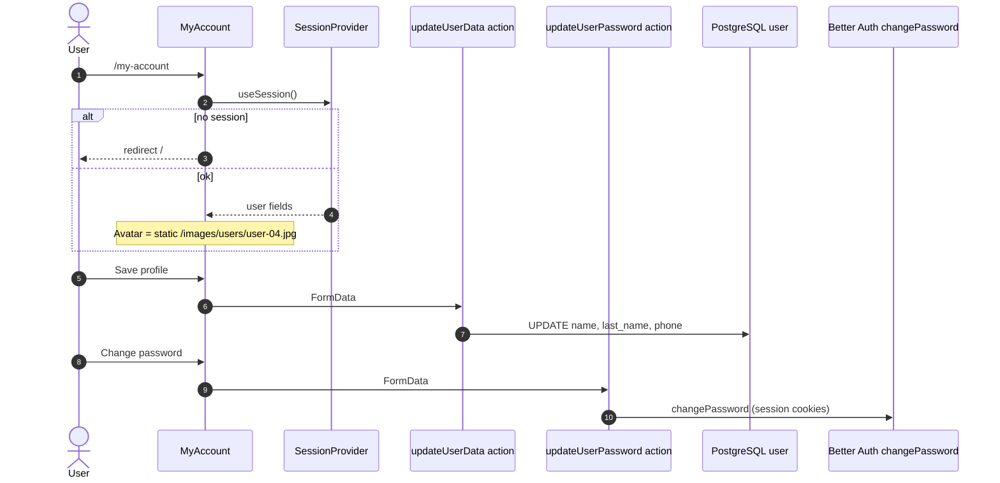

# Profile view / edit (Mermaid)

```mermaid
sequenceDiagram
    autonumber
    actor U as User
    participant M as MyAccount
    participant S as SessionProvider
    participant PA as updateUserData action
    participant PW as updateUserPassword action
    participant DB as PostgreSQL user
    participant BA as Better Auth changePassword

    U->>M: /my-account
    M->>S: useSession()
    alt no session
        M-->>U: redirect /
    else ok
        S-->>M: user fields
        Note over M: Avatar = static /images/users/user-04.jpg
    end
    U->>M: Save profile
    M->>PA: FormData
    PA->>DB: UPDATE name, last_name, phone
    U->>M: Change password
    M->>PW: FormData
    PW->>BA: changePassword (session cookies)
```
