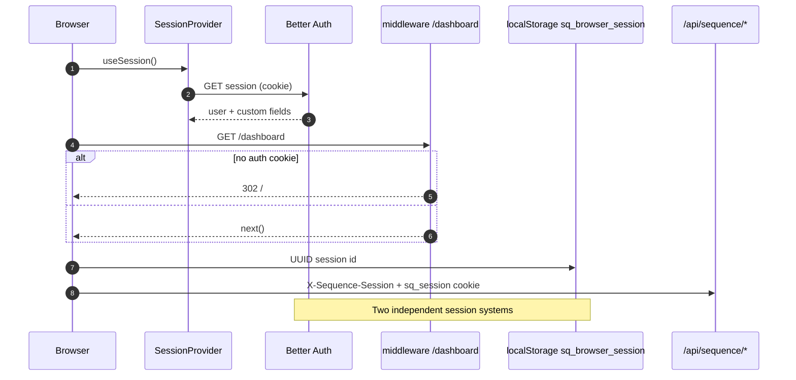

# Session persistence (Mermaid)

```mermaid
sequenceDiagram
    autonumber
    participant B as Browser
    participant SP as SessionProvider
    participant BA as Better Auth
    participant MW as middleware /dashboard
    participant LS as localStorage sq_browser_session
    participant SQ as /api/sequence/*

    B->>SP: useSession()
    SP->>BA: GET session (cookie)
    BA-->>SP: user + custom fields

    B->>MW: GET /dashboard
    alt no auth cookie
        MW-->>B: 302 /
    else
        MW-->>B: next()
    end

    B->>LS: UUID session id
    B->>SQ: X-Sequence-Session + sq_session cookie
    Note over BA,LS: Two independent session systems
```
