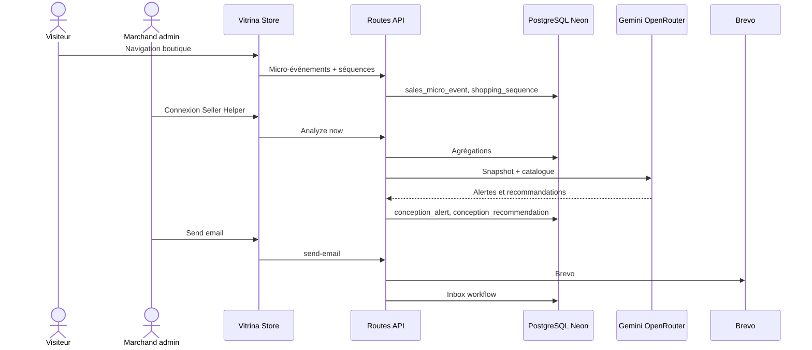
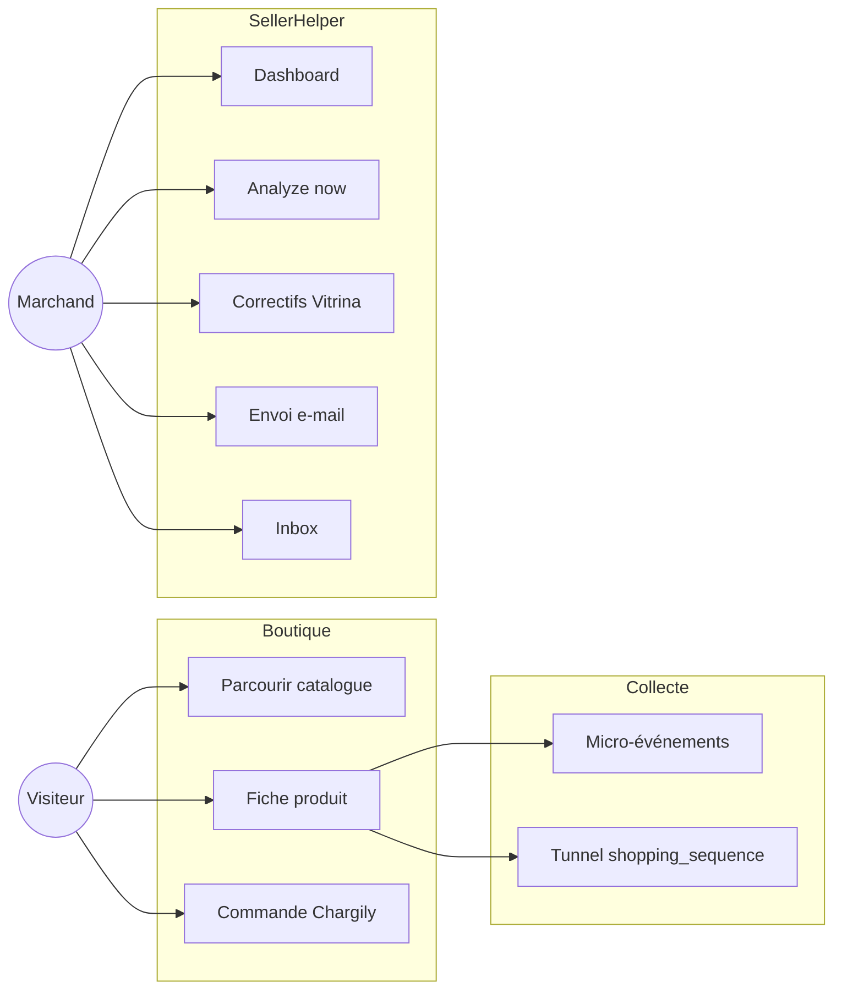
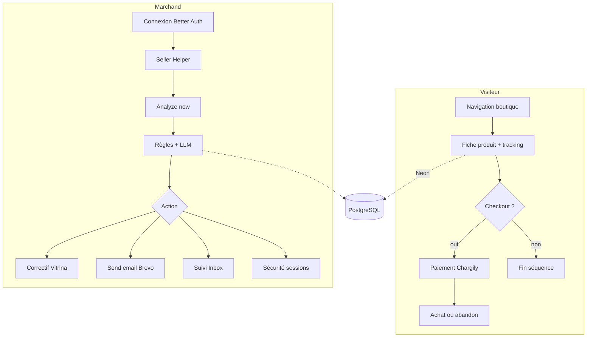
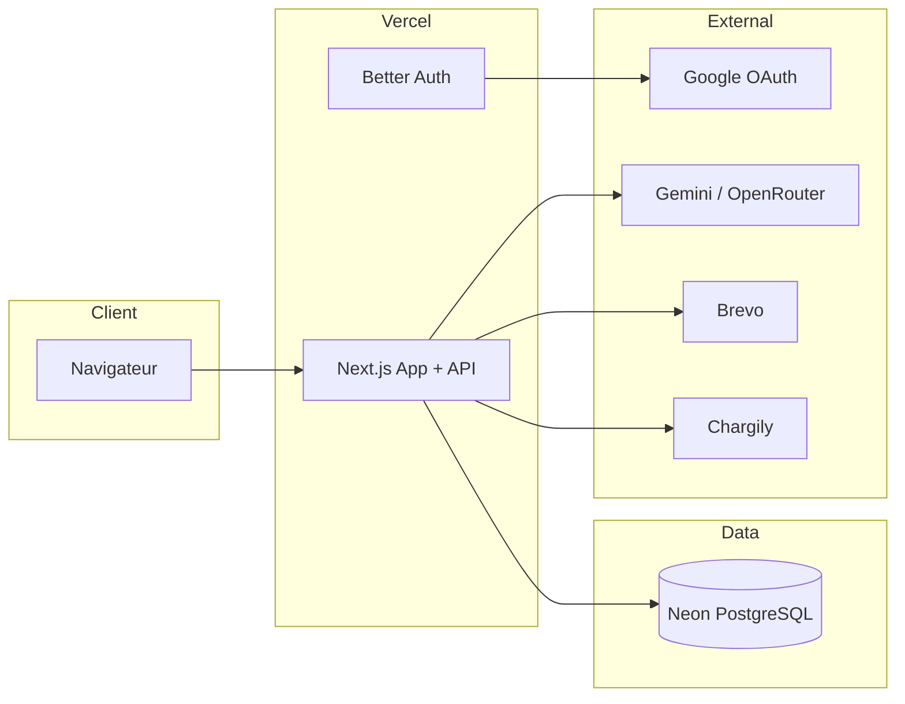

# Diagrammes système (vue d'ensemble)

Fichiers PlantUML sources (prévisualisation extension **PlantUML** ou `npm run uml:render` si Docker/Java disponible) :

| Diagramme | Fichier |
| --- | --- |
| Séquence global | `../sequence-system-overview.puml` |
| Classes | `../class-system-overview.puml` |
| Cas d'utilisation | `../usecase-system-overview.puml` |
| Activité | `../activity-system-overview.puml` |
| Déploiement | `../deployment-system-overview.puml` |

## Séquence (Mermaid)

## Cas d'utilisation (Mermaid)

## Activité (Mermaid)

## Déploiement (Mermaid)

